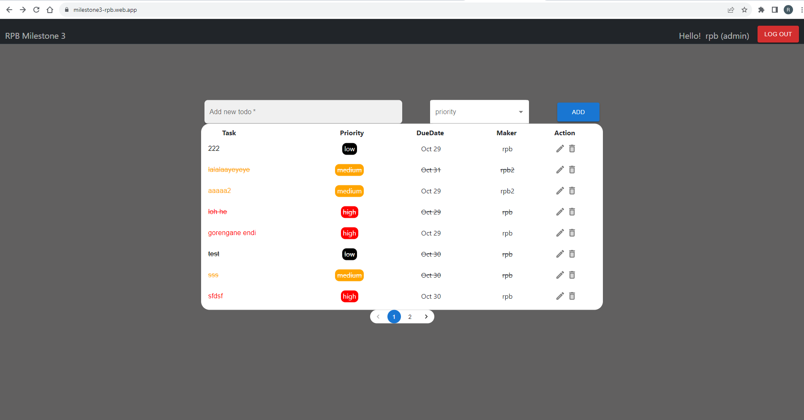

# Full-Stack Project milestone 3

Development project from designing, building, and maintaining both the server-side (back end) and client-side (front end) components of an application. This individual manages the entire software stack, ensuring the integration and functionality of both ends for a complete user experience.

## Table of content

- Technologies used

- Front-end sneak peek

- Authentication & Authorization

- Security Test

- API documentation

- App testing

- Deployment

## Technologies  used

- Typescript

- BE: NodeJs / Express

- FE: React

## Front-end sneak peek



## Back-end Authentication

```js
import { Request, Response, NextFunction } from 'express';

const authentication = (req: Request, res: Response, next: NextFunction) => {
    const authHeader = req.headers.authorization    
    if (!authHeader) {
        res.status(401).json({ error: 'Acces forbidden' })
    }
    next()    
}

export default authentication
```

## Back-end Authorization

##### By Role :

```js
//------ getTodo ------
const getAllTodo = async (req: Request, res: Response) => {
  const decodedToken = getToken(req)
  const { userRole, username } = loggedUser(decodedToken);
console.log('test', userRole, username )

  try {
    if (userRole == "admin") {
      const todo = await getMakerTodos();
      return res.status(200).json({
        success: true,
        message: "Successfully fetched all todo",
        result: todo,
        user: username,
        role: userRole
      });
    } else if(userRole == "guest") {
      const todo = await getMakerTodos(username);
      return res.status(200).json({
        success: true,
        message: "Successfully fetched todos for the user",
        result: todo,
        user: username,
        role: userRole
      });
    }
    else {
      return res.status(403).json({
        success: false,
        message: "Please login first"
      });
    }
  } catch (error) {
    console.log(error);
    return res.status(500).json({
      success: false,
      message: "Failed to get todos",
    });
  }
};
```

##### By Username :

- update Todolist authorization

```js
if(todoId.maker == username){
      const updatedStatus = await updateMakerTodos(id , todo, status, priority, dueDate);
      if (updatedStatus.success) {
        return res.status(200).json({
          success: true,
          message: "Successfully updated status",
          updatedData: {todo, status, dueDate}
        });
      } else {
        return res.status(updatedStatus.status).json({
          success: false,
          message: updatedStatus.message,
        });
      }
    } else {
      return res.status(403).json({
        success: false,
        message: "You do not have permission to update this todo",
      });
    }
```

## Security test

- Front-end :
  
  

- Back-end:
  
  

## Postmant API documentation

- Documentation link:<br>
    https://documenter.getpostman.com/view/29092304/2s9YRGw8Tq
- Set variable {{base_url}} to:<br>
    https://us-central1-milestone3-rpb.cloudfunctions.net/milestone3_rpb

## API End Point

|                                                                   | Endpoint               | Req body                                                                                       | Authorization |
| ----------------------------------------------------------------- | ---------------------- | ---------------------------------------------------------------------------------------------- | ------------- |
| Login                                                             | POST /v1/auth/login    | username, password                                                                             | -             |
| Register                                                          | POST /v1/auth/register | username, Email, password                                                                      | -             |
| Get all todolist (admin)<br>Get logged in user's todolist (guest) | GET<br>/v1/todos       | -                                                                                              | by role       |
| Add new todo                                                      | POST<br>/v1/todos      | todo, priority<br/>(status auto set to "in progress"<br/>and dueDate auto set to 2 days ahead) | -             |
| Update todo                                                       | PUT<br>/v1/todos/:id   | todo, status, dueDate                                                                          | by username   |
| Delete todo                                                       | DEL<br>/v1/todos/:id   |                                                                                                | by username   |

## Users for test

- admin

```json
{
"username":"rpb"
"password":"rpb123"
}
```

- guest

```json
{
"username":"rpb2"
"password":"rpb123"
}
```

## Deployment

###### Both BE and FE Deployed to Firebase

- Front-end: https://milestone3-rpb.web.app

- Back-end: https://us-central1-milestone3-rpb.cloudfunctions.net/milestone3_rpb


